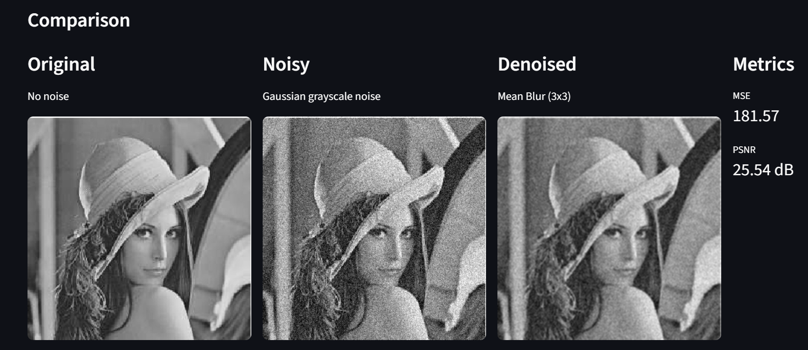
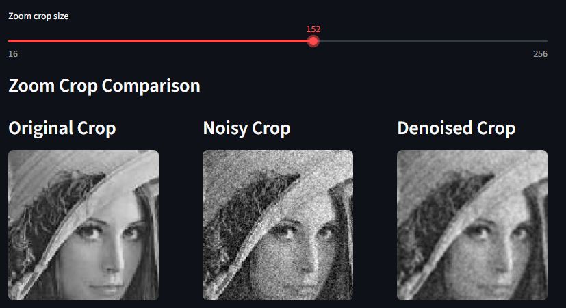

# MIA  Image Filtering App

## project summary
This project is an interactive Streamlit web application designed to demonstrate the effects of different image noise types and denoising techniques. It allows users to upload their own image or use a default image to visually explore how noise degrades image quality and how filtering methods can restore it.

The application supports three noise models: Gaussian grayscale noise, salt-and-pepper noise, and white grayscale noise. Users can control the strength or amount of noise using sliders. After noise is applied, the user can choose from several denoising methods. For most filters, the kernel size can also be adjusted.

The app compares the original, noisy, and denoised images side by side. It also computes quantitative image quality metrics to evaluate the denoising result. In addition, a residual image is displayed to show the difference between the original and denoised image, helping users understand what information was lost or altered during processing.

A zoom crop feature is included to allow closer inspection of image details. Users can adjust the crop size and compare enlarged regions of the original, noisy, and denoised images. This makes it easier to observe fine image structures, artifacts, and the effectiveness of each denoising method.

## local run instructions
Activate the python virtual environment in a Unix/macOS terminal:
`source MIA-App_env/bin/activate`  
Start the app with:
`streamlit run app.py`

## Hugging Face Space URL

## screenshots
### Upload foto here:

### Choose noise and filter:

### Compare images here:

### You can zoom in to the picture for detailed comparison:

## known limitations